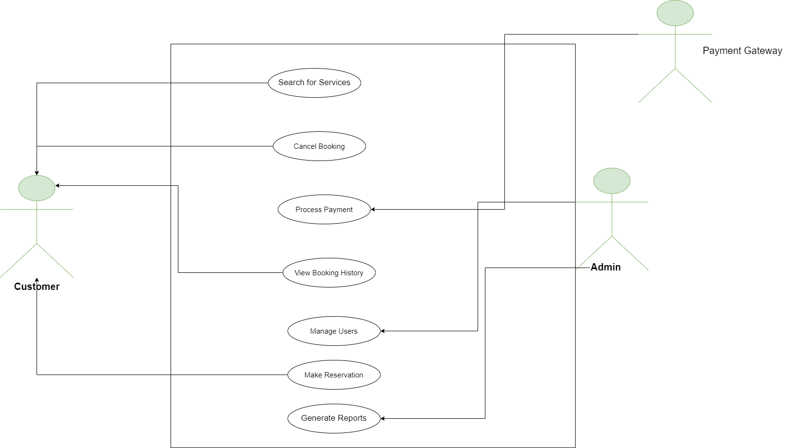

**Requirement Analysis in Software Development**

**Objective**   

The Objective of this README.md file is to  

-Understand the SDLC process and the role of requirement analysis in it.

-Concept of Requirement Analysis.

-Identify the key activities involved in Requirement Analysis.

-Identify and categorize functional and non-functional requirements for given systems.

**What is Requirement Analysis?**

Requirement Analysis involves identifying user expectations for a new or modified product.

- It ensures that the project team systematically gathers, analyzes, and defines the software requirements.
  
- Ensures the final product meets the defined requirements.

**Why is Requirement Analysis Important?**

- Provides a solid foundation for designing and developing the system.

- Prevent conflicts and communication gaps during development and testing

- Facilitates accurate estimation of project cost, resources, and time

**Key Activities in Requirement Analysis**

**1. Requirement Gathering**

Collect initial information about what the stakeholders need from the system.

- Identifying stakeholders (e.g., clients, end-users, subject matter experts).
  
- Collecting high-level needs and objectives from these stakeholders.
  
- Organizing meetings, surveys, and workshops to gather input.

**2. Requirement Elicitation**
   
- Extract detailed requirements from stakeholders through different techniques to understand their true needs.

- Engaging with stakeholders to understand their explicit and implicit needs.
  
- Asking probing questions to uncover hidden requirements.
  
- Encouraging stakeholders to prioritize and rank their needs.
  
- Facilitating collaborative discussions to clarify vague requirements.

**3. Requirement Documentation**

 Clearly document the requirements so they can be referenced throughout the project lifecycle.

**Activities:**

-  Organizing and writing clear, concise, and unambiguous requirements.
  
- Defining functional and non-functional requirements.
  
- Ensuring traceability of requirements to stakeholders and business goals.
  
- Using standardized formats or templates (e.g., user stories, use cases, functional specifications).

**4. Requirement Analysis and Modeling**

- Analyze, structure, and model the gathered requirements to uncover dependencies, conflicts, and implications.

**Activities:**

- Breaking down complex requirements into smaller, manageable components.
  
- Prioritizing requirements based on importance and feasibility.
  
- Resolving conflicts between requirements and refining them.
  
- Creating models (e.g., process flow diagrams, data flow diagrams, entity-relationship diagrams) to represent requirements.

**5. Requirement Validation**

Ensure the requirements meet stakeholder expectations, are feasible, and align with the project's objectives.

**Activities:**

- Reviewing the requirements with stakeholders to confirm they are correct and complete.
  
- Checking for consistency, feasibility, and alignment with business objectives.

- Ensuring that all stakeholders agree on the requirements.
  
- Identifying and resolving any ambiguities, contradictions, or gaps.

**Types of Requirements**

1) Functional Requirement
   -  Deals with what the system should do
     
   -  Deals with Behaviour and Feature of system
     
     Example : Booking Service , Search service , Payment Service

2) Non Functional Requirements

   - Focus on how the system must perform
  
   - Focus on peformance, usability, security
  
   - Also known as Non behavioural Requirements
  
   - Example  : The system must process each booking request within 3 seconds ,  The system must provide real-time feedback(A spinning loader appears when fetching booking data)

**Use Case Diagrams**

Use case diagrams visually represent the interactions between users (actors) and a system

**Benefits of Use Case Diagrams**

- Provide a clear visual representation of system functionalities.

- Help in identifying and organizing system requirements.

- Facilitate communication among stakeholders and development team.

**Acceptance Criteria**

**Importance of Acceptance Criteria in Requirement Analysis**

Acceptance criteria (AC) are essential in requirement analysis because they define the conditions that must be met for a feature to be considered complete and satisfactory.

- Clarity: Eliminates ambiguity in requirements.

- Alignment: Ensures all stakeholders agree on expectations.

- Testing Basis: Acts as a foundation for test cases and validation.

- Scope Control: Prevents scope creep by defining boundaries.

- Quality Assurance: Guarantees deliverables meet business and user needs.
  

**Example of Acceptance Criteria for a Checkout Feature**

**Payment Options:**

- The system must allow users to pay via credit card, debit card, and PayPal.

**Booking Confirmation:**

- After payment, users must receive a booking confirmation email with details.

- Confirmation should include booking ID, payment summary.
  
**Error Handling:**

- If payment fails, the system must display an error message and allow retry.

